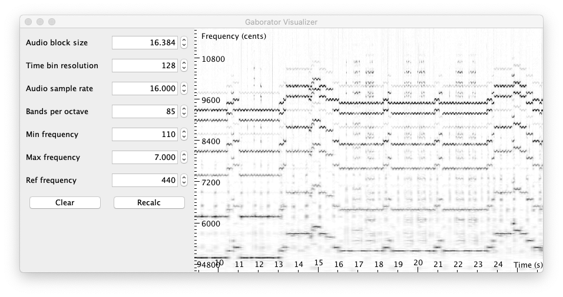

# JGaborator - High resolution spectral transforms from Java

This library calculates fine-grained constant-Q spectral representations of audio signals quickly from Java. The spectral transform can be visualized or further processed in a Music Information Retrieval or machine learning  processing chain.

The calculation of a [Gabor transform](https://en.wikipedia.org/wiki/Gabor_transform) is done by a C++ library named [Gaborator](http://gaborator.com). A Java native interface (JNI) bridge to the C++ Gaborator is provided here. A combination of Gaborator and a fast FFT library (such as [pfft](https://bitbucket.org/jpommier/pffft)) allows fine-grained constant-Q transforms at a rate of about 200 times real-time on moderate hardware.  

For more information on the Gaborator C++ library by  Andreas Gustafsson, please see the [gaborator.com](http://gaborator.com) website or a talk by the author on the library called [Exploring time-frequency space with the Gaborator](https://www.youtube.com/watch?v=ONJVJBmFiuE)

While the gaborator allows reversible transforms, only a forward transform (from time domain to the spectral domain) is currently supported by JGaborator.

A spectral visualization tool for spectral information is part of this package. See below for a screenshot: 

## Using JGaborator

JGaborator depends on Java. Please __install a Java runtime on your system path__ before trying to use JGaborator. Once this is done simply download the [latest JGaborator version](https://mvn.0110.be/releases/be/ugent/jgaborator/jgaborator/0.7/jgaborator-0.7-all.jar) and double click the JAR file. JGaborator tries to load a precompiled library for your platform but this might still fail. In that case you will need to compile the JNI library according to the instructions below.

It is also possible to start JGaborator via the command line:

~~~~~~~~
git clone https://github.com/JorenSix/JGaborator
cd JGaborator
./gradlew shadowJar
java -jar build/libs/JGaborator-0.7-all.jar
~~~~~~~~

To transform audio from the time domain to the spectral domain and visualize the spectrogram **drag and drop an audio file** to the graph area. The visualizer decodes and resamples encoded audio of almost any kind using [ffmpeg](https://www.ffmpeg.org/). Make sure a recent version is available on your path. If not, install it using your packet manager for example `apt-get install ffmpeg` or `brew install ffmpeg`.

## Gabor transform from Java

The following code snippet shows how to calculate a spectral Gabor transform from Java. JGaborator attempts to automatically unpack  a JNI library. If this fails you might need to compile a version yourself and you will need to set or check the `java.library.path` variable. For context of this code see the JGaboratorBrowser.

~~~~~
JGaborator zsazsa = new JGaborator(stepSize, sampleRate, bandsPerOctave, minFrequency,maxFrequency,refFrequency,resolution);
AudioDispatcher ad = AudioDispatcherFactory.fromPipe(path, sampleRate, stepSize, 0);
ad.addAudioProcessor(zsazsa);
ad.run();
List<float[]> coefficients = zsazsa.getCoefficents()
~~~~~

## Folder structure

* `src` contains the Java source files
* `gaborator` contains the C++ JNI bridge and a makefile
  * `gaborator\gaborator-1.x` The gaborator C++ library, licensed under AGPL
  * `gaborator\pffft` the pffft c-library, licensed under a BSD type license
* `media` contains some supporting files and screenshots.

## Compilation and development for JGaborator

Zig, Ruby and Java are correctly installed on your system the following set of commands should get you started:

~~~~~~~~
#check the JAVA_HOME variable
echo $JAVA_HOME
#Go to the jni bridge director
cd gaborator 
# Cross-compiles the JNI lib for all platforms using Zig
make
cd ..
./gradlew build 
./gradlew shadowJar
#Start the jar file making sure the JNI brige is in the java library path
java -jar build/libs/JGaborator-0.7-all.jar 
~~~~~~~~

### Cross-Compilation of gaborator with Zig

The following code shows how to corss-compile the gaborator library with Zig. In this example a windows DLL-file is build from macOS. 

~~~~~~~~
bash
git clone --depth 1 https://github.com/JorenSix/JGaborator
cd JGaborator/gaborator
echo $JAVA_HOME
JNI_INCLUDES=-I"$JAVA_HOME/include"\ -I"$JAVA_HOME/include/darwin"\ -I"$JAVA_HOME/include/linux"
zig cc  -target x86_64-windows-gnu -c -O3 -ffast-math -fPIC pffft/pffft.c -o pffft/pffft.o
zig cc  -target x86_64-windows-gnu -c -O3 -ffast-math -fPIC -DFFTPACK_DOUBLE_PRECISION pffft/fftpack.c -o pffft/fftpack.o
zig c++ -target x86_64-windows-gnu -I"pffft" -I"gaborator-1.7"  $JNI_INCLUDES -O3\
-ffast-math -DGABORATOR_USE_PFFFT  -o libjgaborator.dll jgaborator.cc pffft/pffft.o pffft/fftpack.o
file libjgaborator.dll
# libjgaborator.dll: PE32+ executable (console) x86-64, for MS Windows
~~~~~~~~

### Compilation of gaborator on Linux
On Linux the use of the pfft library is advised.  Compilation of the JNI bride on a Linux system with a JDK installed and a correctly set `JAVA_HOME` can take the following form: 

~~~~~~~~
cc -c -O3 -ffast-math -fPIC pffft/pffft.c -o pffft/pffft.o
cc -c -O3 -ffast-math -fPIC -DFFTPACK_DOUBLE_PRECISION pffft/fftpack.c -o pffft/fftpack.o
c++ -std=c++11 -I"gaborator-1.2" -I"pffft" -I"$(JAVA_HOME)/include" -I"$(JAVA_HOME)/include/linux" -fPIC -shared -O3 -ffast-math -DGABORATOR_USE_PFFFT  -o libjgaborator.so jgaborator.cc pffft/pffft.o pffft/fftpack.o	
~~~~~~~~

The makefile contains similar instructions.

### Compilation of gaborator on macOS

On macOS the Apple's vDSP library can be used by defining GABORATOR_USE_VDSP and linking with the Accelerate framework. The following should suffice:

~~~~~~~~
c++ -std=c++11 -I"gaborator-1.7"  -I"$(JAVA_HOME)/include" -I"$(JAVA_HOME)/include/darwin" -O3 -ffast-math -DGABORATOR_USE_VDSP  -o libjgaborator.so jgaborator.cc  -framework Accelerate
~~~~~~~~

The makefile contains similar instructions. To compile the mac version call `make mac` If the JAVA_HOME environment variable is not set, run the following before calling `c++`:

~~~~~~~~
export JAVA_HOME=$(/usr/libexec/java_home) #optionally set the JAVA_HOME
~~~~~~~~

There is a precompiled version for the M1 (aarch64) platform. 

## Docker

There is a dockerfile provided to test jgaborator in docker. The provided dockerfile runs the Amazon Corretto JRE on LinuxKit.
It is mainly used to test whether the correct JNI library is unpacked for more exotic platforms.

~~~~~~~~
docker build -t jgaborator:0.7 media
docker run jgaborator:0.7 /bin/bash -c "curl https://filesamples.com/samples/audio/mp3/sample3.mp3 --output sample.mp3  && java -jar jgaborator.jar sample.mp3"
~~~~~~~~

## License
In the spirit of the packaged gaborator library this code is also licensed under an AGPL license.

## Version
0.5 2018 Initial release

0.6 2021 automatic loading of JNI library on some platforms. JGaborators is now safe to use from multiple (Java) threads.

0.7 2023 Zig cross-compiler for gaborator. Changed Java build environment to gradle. Maven package. CI. Upgraded gaborator from 1.2 to 1.7. Automatic example file. CLI runner.
