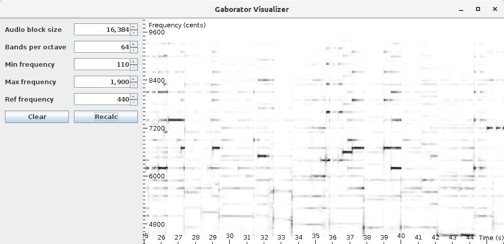

# JGaborator 

This library calculates fine grained constant-Q spectral representations of audio signals quickly from Java. The calculation of a [Gabor transform](https://en.wikipedia.org/wiki/Gabor_transform) is done by a C++ library named [Gaborator](http://gaborator.com). A Java native interface (JNI) bridge to the C++ Gaborator is provided here. A combination of Gaborator and a fast FFT library (such as [pfft](https://bitbucket.org/jpommier/pffft)) allows fine grained constant-Q transforms at a rate of about 200 times real-time on moderate hardware.  It can serve as a front-end for several audio processing or MIR applications.

For more information on the Gaborator C++ library by  Andreas Gustafsson, please see the [gaborator.com](http://gaborator.com) website or a talk by the author on the library called [Exploring time-frequency space with the Gaborator](https://www.youtube.com/watch?v=ONJVJBmFiuE)

While the gaborator allows reversible transforms, only a forward transform (from time domain to the spectral domain) is currently supported from java.

A spectral visualization tool for sprectral information is part of this package. See below for a screenshot: 

## Getting started

Assuming [Apache Ant](https://ant.apache.org/), a c++ compiler and Java are correctly installed on your system the following set of commands should get you started:

~~~~~~~~
cd gaborator #Go to the jni bridge director
make # compiles the JNI bridge, call make mac on Mac OS X
cd ../build # go to the java build directory
ant clean # Make sure no compiled files are remaining
ant # Compiles and  packages the library
cp ../gaborator/libjgaborator.so . #Copy the jni bridge
java -Djava.library.path=. -jar JGaboratorBrowser.jar #Start the jar file making sure the JNI brige is in the java library path
~~~~~~~~

To visualize a spectrogram **drag and drop an audio file** to the graph. The visualizer decodes and resamples encoded audio of almost any kind using [ffmpeg](https://www.ffmpeg.org/). Make sure a recent version is available on your path. If not, install it using your packet manager for example `apt-get install ffmpeg` or `brew install ffmpeg`.

## Folder structure

* `src` contains the java source files
* `gaborator` contains the c++ JNI bridge and a makefile
  * `gaborator\gaborator-1.2` The gaborator C++ library, licensed under AGPL
  * `gaborator\pfft` the pfft C++ library, licensed under a BSD type license
* `build` ant build files
* `lib` a Java dependency: the TarsosDSP audio processing library.

## Compilation on different platforms

For convenience and to ensure compatibility, both pfft and gaborator code is included in this repository. The pfft library has a BSD license while gaborator has an AGPL license.  

On Linux the use of the pfft library is advised.  Compilation of the JNI bride on a Linux system with a JDK installed and a correctly set `JAVA_HOME` can take the following form: 

~~~~~~~~
cc -c -O3 -ffast-math -fPIC pffft/pffft.c -o pffft/pffft.o
cc -c -O3 -ffast-math -fPIC -DFFTPACK_DOUBLE_PRECISION pffft/fftpack.c -o pffft/fftpack.o
c++ -std=c++11 -I"gaborator-1.2" -I"pffft" -I"$(JAVA_HOME)/include" -I"$(JAVA_HOME)/include/linux" -fPIC -shared -O3 -ffast-math -DGABORATOR_USE_PFFFT  -o libjgaborator.so jgaborator.cc pffft/pffft.o pffft/fftpack.o	
~~~~~~~~

On Mac OS X the Apple's vDSP library can be used by defining GABORATOR_USE_VDSP and linking with the Accelerate framework. The following should suffice:

~~~~~~~~
c++ -std=c++11 -I"gaborator-1.2"  -I"$(JAVA_HOME)/include" -I"$(JAVA_HOME)/include/mac" -O3 -ffast-math -DGABORATOR_USE_VDSP  -o libjgaborator.so jgaborator.cc  -framework Accelerate
~~~~~~~~

## Gabor transform from Java

The following code snippet shows how to calculate a spectral Gabor transform from Java. Remember to set your `java.library.path` to include the JNI library. For context of this code see the JGaboratorBrowser.

~~~~~
JGaborator zsazsa = new JGaborator(stepSize, sampleRate, bandsPerOctave, minFrequency,maxFrequency,refFrequency,resolution);
AudioDispatcher ad = AudioDispatcherFactory.fromPipe(path, sampleRate, stepSize, 0);
ad.addAudioProcessor(zsazsa);
ad.run();
float[][] coefficients = zsazsa.getCoefficents()
~~~~

## License
In the spirit of the packaged gaborator library this code is also licensed under an AGPL license.
